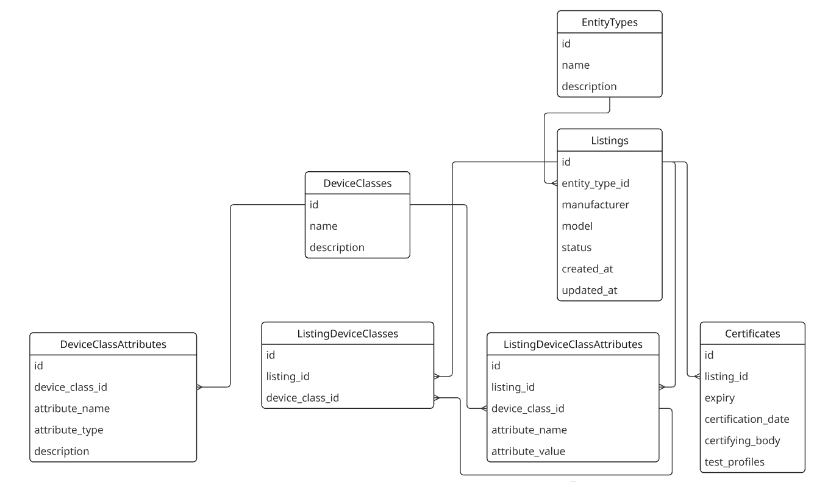

# Open CEC API & Data Model
This is an unofficial refactor of the Clean Energy Council (CEC) API for Software Communication Clients (SCC), using FastAPI with a flexible and extensible underlying data model, supported by Docker and Postgres. It supports the listing of certified CSIP-AUS servers and clients, and facilitates the easy access of listed entities.

This repository is not affiliated with the Clean Energy Council.

## Flexible, Feature-Rich, & Extensible
The new data model supports the following functionality:
* Ability to list both CSIP-AUS clients and servers
* Clients can be any type or combination of types (inverters, BESS, inverter+BESS)
* Entities are linked to certificates which provide information about their CSIP-AUS capabilities
* Easy to add, update, and view listings
* Enables flexibility for future changes


## Development Setup
Clone this repo and `cd` into it. Then, run the following:
```bash
python3 -m venv cec_env
source cec_env/bin/activate
python3 -m pip install poetry
poetry install
```

### API Authentication
In order to access the API endpoints, you will need to define a .env file on startup which contains a (hashed) default API key associated with the environment variable ```OPEN_CEC_API_API_KEY_HASH```. The unhashed value of your key must be provided in the header of each HTTP request made to the API server, with header key ```x-api-key```.

You can automatically generate a valid API key using the script ```generate_hash.py``` in the ```deploy``` subdirectory.

### Example Request
For example, to obtain every listing currently stored in the database, you could use cURL to execute the following command:
```bash
curl -X 'GET' \
  'http://0.0.0.0:8080/listings' \
  -H 'accept: application/json' \
  -H 'x-api-key: <YOUR_API_KEY>'
```

### Running the API
The FastAPI instance and Postgres instance are coordinated via Docker. From the top-level directory of this repository, you can run the following command to start both services:

```bash
docker compose -f deploy/docker-compose.yml up --build
```

By default, in development mode, the database will automatically be populated with synthetic data.

### Unit Test Suite
To run the unit test suite, you can simply run the following command from the top-level directory:
```
pytest
```


## Data Model
The underlying data model is illustrated in the Entity Relationship Diagram below.



This data model has the following features:
* EntityTypes permit the listing of both CSIP-AUS clients and servers
* The ListingDeviceClasses junction table means a single entity can be composed of multiple DeviceClasses. For example, a CSIP-AUS client can be listed as both an inverter + EVSE device, with the associated attributes.
* Each Listing can be associated with multiple active Certificates
* The design permits ongoing changes to the listing structure.

## Documentation

The API specification is auto-generated using Swagger and can be accessed via the ```/docs``` endpoint whenever the API is running. For example,

```
http://0.0.0.0:8080/docs
```

## API Settings

API settings such as the server host and port can be modified by adding the relevant entries, prefixed by ```OPEN_CEC_API_```, in the project .env file. The names of these entries can be found at ```open_cec_api.settings.py```. For example, to change the port, you would add the following to your .env file:

```
OPEN_CEC_API_HOST=8888
```

<!-- ### Database

```bash
docker exec -it open-cec-api-postgres-1 psql -d open_cec_db -U open_cec_user
``` -->